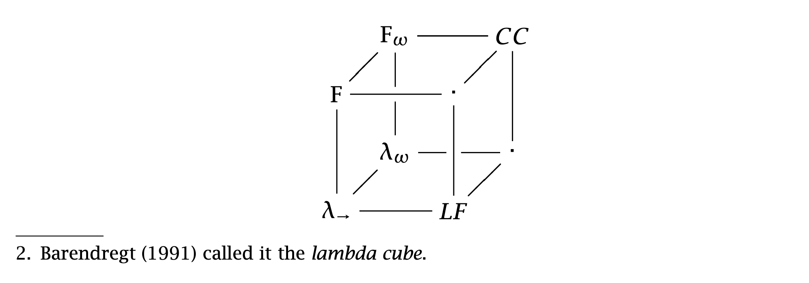

## books

### An Introduction to Proof Theory (Buss-1998).pdf
learn logic and proof system:
- classical/intuitionistic/minimal logic
- first-order/predicate logic
- Hilbert-style system
- Gentzen-style system
    - sequent calculus
    - natural deduction

### Compilers - Principles, Techniques and Tools 2nd (Aho-2007).pdf
learn compilers, understand: 
- lexical analysis (tokenizer, NFA, DFA, regular expression)
- syntax analysis (parser, grammar)
- semantic analysis (interpreter)

### Mastering Regular Expressions 3rd (Friedl-2006).pdf
learn to use regular expression, master:
- character class
- word boundary
- quantifier
- group/backreference
- lookaround

### Speech and Language Processing 3rd (Jurafsky-2019).pdf
learn tasks and history of nlp, include:
- language models
- constituency parsing
- dependency parsing
- coreference
- question answering
- chabots

### The Annotated Turing (Petzold-2008).pdf
learn Turing's points.
- background
    - There does not exist a 1-1 correspondence between natural numbers and real numbers.
    - There exists a 1-1 correspondence between all subsets of natural numbers and real numbers.
    - There exists a 1-1 correspondence between real numbers on 1 dim line and 2 dim plane.
    - Provability is a syntactic concept, however, truth is a semantic concept.
    - 4 basic qualities of formal system: Independence, Consistency, Completeness, Decidability
    - Gödel's 1929 doctoral thesis showed the first-order predicate logic was complete.
    > 
    Hilbert's final years were spent in loneliness and senility. He died in 1943. On Hilbert's tombstone in Gottingen are the words 
    Wir mussen wissen.\
    Wir werden wissen.\
    We must know. We shall know. Except that now when people read Hilbert's words, 
    all they can think about is Godel and Church and Turing, incompleteness and undecidability
- Turing
    - Turing machine + Turing test
    - Turing machines are countable.
    - The computable numbers are therefore countable.
    - The Universal Turing Machine(UTM).    
    - Turing machines are not enumerable.
    - There is no general method to determine a Turing machine is circular or not.

### The Entscheidungsproblem and Alan Turing (Brodkorb-2019).pdf
learn Turing's solution the Entscheidungsproblem:
- basics
    - Turing machine consists of a finite list of states, a finite list of symbols, and a finite list of instructions.
    - A computable function, is any function that yields the same output no matter how many times you run the algorithm, for a given input. Furthermore, the domain of a total computable function is the natural numbers.
    - A partial computable function is any function that is not necessarily defined for every input, provided that there exists an algorithm for that function.
- keys
    - We can list all the partial computable functions because we can list the corresponding Description Numbers of the Turing machines.
    - We cannot list all total computable functions.

### The Mechanization of Mathematics (Beeson-2004).pdf
learn pogress of the mechanization of mathematics:
- Pascal(1623-1662)
    - built a machine that could add and subtract
- Leibniz(1646-1716)
    - first machine with all four arithmetic capabilities
- Boole(1815-1864)
    - Boolean algebra
- Frege(1848-1925)
    - create modern logic including "for all", "there exists"
- Russell(1872-1970)
    - create paradox from Frege's logic, write Principia Mathematica
- Hilbert(1862-1943)
    - program\
        he would first reduce mathematics to logic, using formal languages, and then reduce logic to computation.
    - Entscheidungsproblem\
        whether there exists a decision algorithm such that:
        - It takes two inputs: a finite set of axioms, and a conjecture.
        - It computes for a finite time and outputs either a proof of the conjecture from the axioms, or “no proof exists”.
        - The result is always correct.
    - Since a first-order theory generally has many models, can we decide (given a theory) which formulas are true in all the models? It also led directly to the formulation of the completeness problem: Are the formulas true in all the models exactly those that have proofs from the axioms? The former problem was solved by Turing and Church, the latter by Gödel, both within a few years of the publication of Hilbert-Ackermann.
    - The results of Turing, Church, and Gödel are commonly called “negative” results in that they show the impossibility of a complete reduction of mathematics or logic to computation. Hilbert’s program was a hopeless pipe dream.
- Turing(1912-1954)
    - Turing machine\
        He argued that if any machine could perform a computation, then some Turing machine could perform it. The argument focuses on the assertion that any machine’s operations could be simulated, one step at a time, by certain simple operations, and that Turing machines were capable of those simple operations. 
    - there exist problems that cannot be solved by any algorithm. The most well-known of these is the halting problem–there exists no Turing machine that takes as inputs a Turing machine M and an input x for M, and determines correctly whether M halts on input x.
    - These two papers of Turing lie near the roots of the subjects today known as automated deduction and artificial intelligence.
- Church(1903-1995)
    - lambda calculus\
        Church invented the lambda-calculus (often written λ-calculus) and used it to give a definition of algorithm different from Turing’s, and hence an independent solution of the Entscheidungsproblem
    - Arithemtic is undecidable
        Since Peano’s axioms are not first-order, the Entscheidungsproblem does not directly apply to them, and one can ask whether there could be an algorithm that takes a first-order statement about the natural numbers as input, and correctly outputs “true” or “false”.
        Church showed that, nevertheless, there is no such algorithm.
    - equivalence\
        Church’s student Kleene proved the equivalence of the Turing-machine and the λ-calculus definitions of algorithm in his Ph.D. thesis.
- Gödel(1906-1978)
    - incompleteness theorem\
        Whatever system of axioms one writes down in an attempt to axiomatize the truths about the natural numbers, either some false statement will be proved from the axioms, or some true statement will not be proved.
- skill
    - Skolem function
        - eliminate "there exists"
    - resolution
        - extends modus ponens(if p then q + p -> q, ie, p + -p|q -> q), p|r + -p|q -> r|q
        - The basic paradigm for automated deduction then was born: Start with the axioms and negated goal. Perform resolutions (using unification) until a contradiction is reached, or until you run out of time or memory. The modern era in automated deduction could be said to have begun when this paradigm was in place
    - demodulation
        - The use of a set of oriented equations to rewrite subterms of a given term is called “demodulation” in the automated theorem proving community
- overall
    - calculation vs logical inference\
        In fact, typically a mathematical proof consists of some parts that are calculations, and some parts that are logical inferences. Of course, it is possible to recast calculations as logical proofs, and it is possible to recast logical proofs as calculations. But there is an intuitive distinction: a calculation proceeds in a straightforward manner, one step after another, applying obvious rules at each step, until the answer is obtained. While performing a calculation, one needs to be careful, but one does not need to be a genius, once one has figured out what calculation to make. It is “merely a calculation.” When finding a proof, one needs insight, experience, intelligence–even genius–to succeed, because the search space is too large for a systematic search to succeed.
    - on the whole the mechanization of computation has progressed much further than the mechanization of proof.
    - The present power of automated theorem provers has yielded results only in theories based on equality and a few operations or in other very simple theories
    - Tarski's elimination of quantifiers: reduction of algebra with quantifiers to computation
    - a decision procedure has been found for a class including what are usually called combinatorial identities

### Types and Programming Languages (Pierce-2002).pdf
learn type system, understand:
- lambda calculus 
- simply typed lambda calculus
- subtyping
- polymorphism(system F, 2nd order lambda calculus)
- type operator(high-order system)
- lambda cube
    - terms indexed by terms(simply typed lambda calculus)\
      lambda x:X.t
    - terms indexed by types(F system)\
      lambda X. lambda x:X. t
    - types indexed by types(lambda\_{omega})\
      lambda X. X -> X
    - types indexed by terms(LF system)\
      lambda n. FlostListn

### Web Scraping with Python (Mitchell-2015).pdf
learn basic python scraping skills
- html parsing
    - headers
    - cookies
- forms and logins
    - browser inspector check name value
    - requests.post filling form, uploading file, etc
- javascript
    - selenium.webdriver handle Ajax(Asynchronous javascript and xml)
- captcha
    - Tesseract ocr 
- quotes
    >
    Fast scraping is a bad practice that places a heavy burden on the web administrator’s servers, can land you in legal trouble, and is the numberone cause of scrapers getting blacklisted. Add delays to your scrapers and let them run overnight. Remember: Being in a rush to write programs or gather data is a sign of bad project management; plan ahead to avoid messes like this in the first place.

### 编码 隐匿在计算机软硬件背后的语言 (Petzold-2012).pdf
学习计算机是如何从电路搭建起来的，要点如下
- 继电器
- 振荡器
- 触发器
- 随机访问储存器
- 机器码
- 汇编语言
- 晶体管
- 集成电路
- 磁介质储存器

